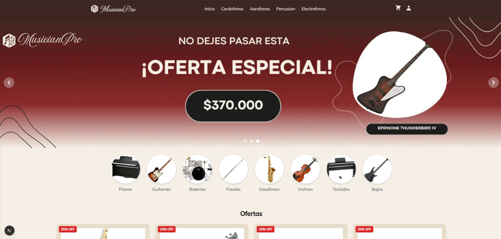
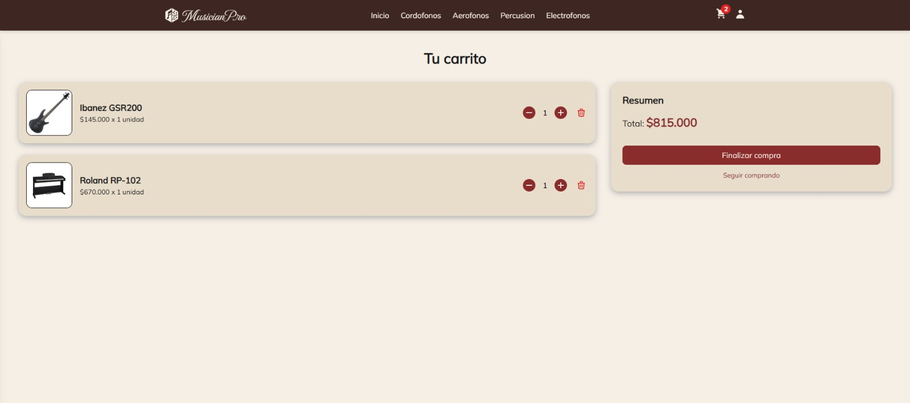
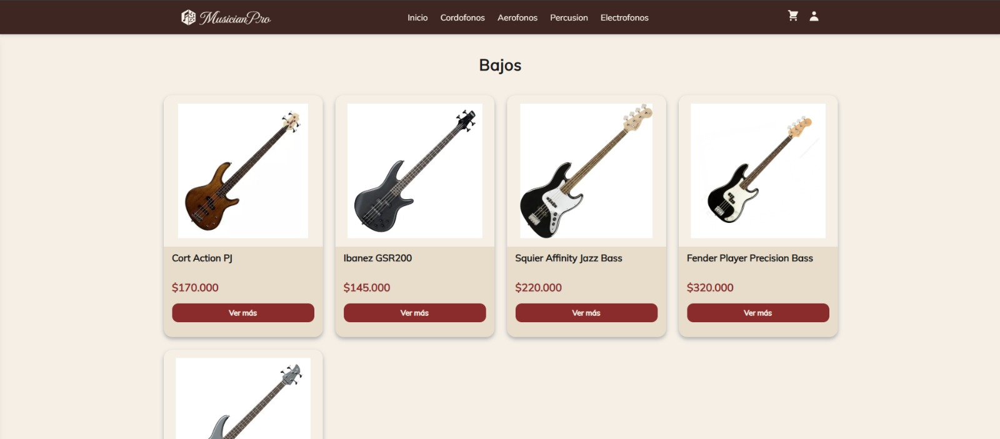
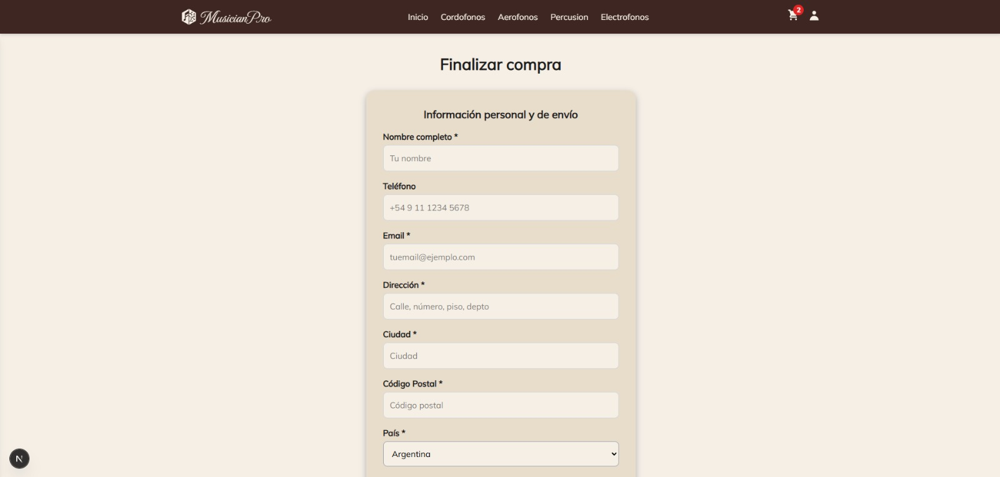
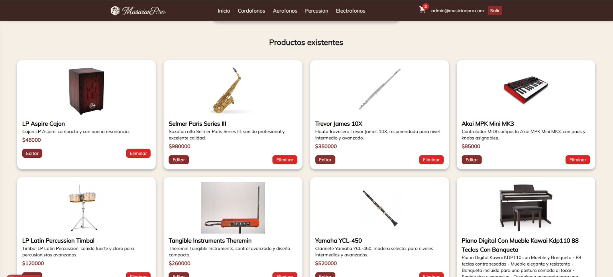

# 🎸 MusicianPro

**MusicianPro** es un e-commerce desarrollado con **Next.js** y **Firebase**, enfocado en la venta de instrumentos musicales. Ofrece una experiencia completa tanto para los usuarios como para los administradores, con navegación intuitiva, carrito de compras, autenticación y panel de administración para gestión de productos.

---

## 🧑‍💻 Tecnologías utilizadas

[](https://nextjs.org/)
[](https://reactjs.org/)
[](https://firebase.google.com/)
[](https://tailwindcss.com/)
[](https://react-icons.github.io/react-icons/)
[](https://vercel.com/)

---

## ✨ Funcionalidades principales

- 🎯 Vista de productos por **categoría** y **subcategoría**
- 🔍 Detalle individual de producto
- 🛒 Carrito de compras persistente con control de stock
- 🔐 Registro e inicio de sesión con Firebase Auth
- 📦 Generación de órdenes de compra y actualización de stock
- 🧑‍💼 Panel de administración (protegido):
  - Crear, editar y eliminar productos
  - Subida de imágenes al Firebase Storage
  - Actualización en tiempo real con Firestore

---

## 📸 Capturas

### 🏠 Página de inicio



### 🛒 Carrito



### 🔍 Detalles



### 🧾 Formulario de compra



### 🔐 Panel de administración



## 🚀 Instalación local

1. Cloná el repositorio:

```bash
git clone https://github.com/ImanolPeralta/musicianpro-nextjs.git
```

2. Accedé al directorio del proyecto:

```bash
cd musicianpro-nextjs
```

3. Instalá las dependencias:

```bash
npm install
```

4. Configurá las variables de entorno en un archivo `.env.local`:

```env
NEXT_PUBLIC_FIREBASE_API_KEY=TU_API_KEY
NEXT_PUBLIC_FIREBASE_AUTH_DOMAIN=TU_AUTH_DOMAIN
NEXT_PUBLIC_FIREBASE_PROJECT_ID=TU_PROJECT_ID
NEXT_PUBLIC_FIREBASE_STORAGE_BUCKET=TU_STORAGE_BUCKET
NEXT_PUBLIC_FIREBASE_MESSAGING_SENDER_ID=TU_SENDER_ID
NEXT_PUBLIC_FIREBASE_APP_ID=TU_APP_ID
NEXT_PUBLIC_BASE_URL=http://localhost:3000
```

5. Ejecutá la aplicación:

```bash
npm run dev
```

---

## 📁 Estructura de carpetas

```
┣ 📂[categoria]
┃ ┗ 📂[subcategoria]
┃   ┣ 📜loading.js
┃   ┗ 📜page.js
┣ 📂admin
┃ ┣ 📜layout.js
┃ ┗ 📜page.js
┣ 📂api
┃ ┗ 📂productos
┃   ┣ 📂[id]
┃   ┃ ┗ 📜route.js
┃   ┗ 📜route.js
┣ 📂cart
┃ ┗ 📜page.js
┣ 📂checkout
┃ ┗ 📜page.js
┣ 📂components
┃ ┣ 📂products
┃ ┃ ┣ 📜CategoriesMenu.js
┃ ┃ ┣ 📜ProductCard.js
┃ ┃ ┣ 📜ProductDetail.js
┃ ┃ ┣ 📜ProductList.js
┃ ┃ ┗ 📜QtySelector.js
┃ ┗ 📂ui
┃   ┣ 📜AutoSlider.js
┃   ┣ 📜BeneficiosSection.js
┃   ┣ 📜Boton.js
┃   ┣ 📜CategoriaDestacada.js
┃   ┣ 📜Counter.js
┃   ┣ 📜Footer.js
┃   ┣ 📜GoBack.js
┃   ┣ 📜ImagenesSlider.js
┃   ┣ 📜InLineLoading.js
┃   ┣ 📜NavBar.js
┃   ┣ 📜Newsletter.js
┃   ┣ 📜OfertasSection.js
┃   ┣ 📜ProductosDestacados.js
┃   ┗ 📜PromoLinks.js
┣ 📂context
┃ ┣ 📜AuthContext.js
┃ ┗ 📜CartContext.js
┣ 📂data
┃ ┗ 📜productos.js
┣ 📂icons
┃ ┣ 📜Logo.js
┃ ┗ 📜logo.svg
┣ 📂login
┃ ┗ 📜page.js
┣ 📂producto
┃ ┗ 📂[id]
┃   ┣ 📜loading.js
┃   ┗ 📜page.js
┣ 📜favicon.ico
┣ 📜globals.css
┣ 📜layout.js
┣ 📜loading.js
┣ 📜not-found.js
┗ 📜page.js

```

---

## 📦 Deploy

El proyecto está desplegado en **Vercel**. Para desplegarlo manualmente:

1. Subí el proyecto a GitHub.
2. Iniciá sesión en [vercel.com](https://vercel.com/).
3. Importá el repositorio desde tu cuenta de GitHub.
4. Configurá las variables de entorno como en `.env.local`.
5. Deploy automático 🚀